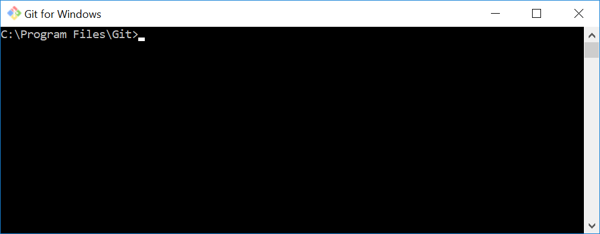

# C Sharp practice repository 
It's a clone of the content that comes with the MCSD guide. Clone the repository and open the 'Playground' solution.

# Cloning
1. Click on 'MCSD' (The blue bread crumb link travismyers/MCSD)
2. Click 'Clone or download' (Green button)
3. Click the clipboard icon next to the url https://github.com/travismyers/MCSD.git
4. Paste that URL into Visual Studio or use Git Command Line
5. [Install Git.](https://git-scm.com/downloads) Instructions for cloning are below under 'Git for Windows'
6. You should have a git application that looks like this...

6. After installing git, paste this into your git command shell: ```git clone https://github.com/travismyers/MCSD.git```
7. You should now have a folder 'MCSD' with several solutions and folders for each chapter

# Git for Windows
[Download Git](https://git-scm.com/downloads)
- [How do I 'clone' a repository?](https://git-scm.com/book/en/v2/Git-Basics-Getting-a-Git-Repository)
- [Clone a repository in Visual Studio](https://docs.microsoft.com/en-us/azure/devops/repos/git/clone?view=vsts&tabs=visual-studio)